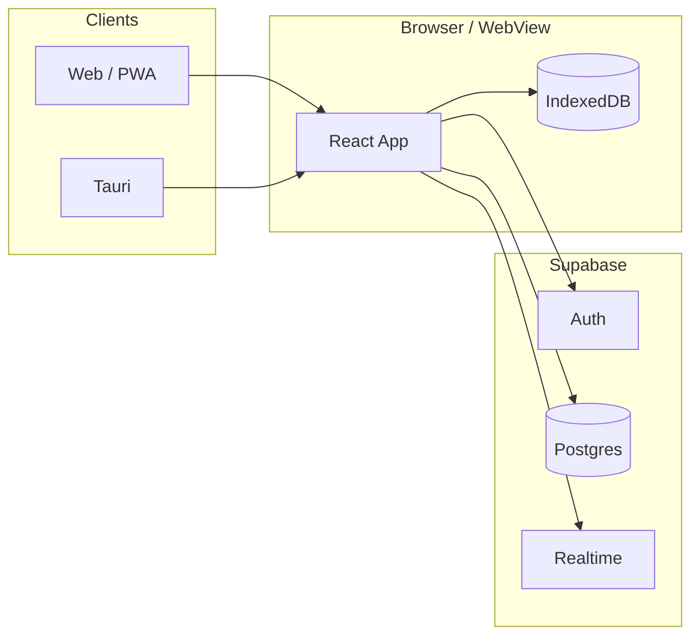

# AnyMemo

[](https://anymemo.vercel.app)
[](https://github.com/minbokang/anymemo/releases)

**[English](#english)** · **한국어** (아래 본문)

AnyMemo는 **웹·모바일(PWA)·데스크톱**에서 같은 계정으로 메모를 쓰고 **실시간 동기화**하는 크로스 플랫폼 메모장입니다.  
**코드 한 벌**(Vite + React)로 여러 환경을 지원하는 것이 이 저장소의 핵심이며, 백엔드 서버 없이 **Supabase**(Auth · Postgres · Realtime)와 **IndexedDB** 오프라인 캐시만 사용합니다.

| | |
|---|---|
| **데모 (웹)** | https://anymemo.vercel.app |
| **문서** | [배포.md](./배포.md) · [DEPLOY.md](./DEPLOY.md) |

### 다운로드 (v0.1.0)

| OS | 설치 파일 |
|----|-----------|
| **macOS** (Apple Silicon) | [DMG](https://github.com/minbokang/anymemo/releases/download/v0.1.0/AnyMemo_0.1.0_aarch64.dmg) · [ZIP](https://github.com/minbokang/anymemo/releases/download/v0.1.0/AnyMemo_0.1.0_macos_aarch64.zip) |
| **Windows** (x64) | [MSI](https://github.com/minbokang/anymemo/releases/download/v0.1.0/AnyMemo_0.1.0_x64_en-US.msi) · [EXE](https://github.com/minbokang/anymemo/releases/download/v0.1.0/AnyMemo_0.1.0_x64-setup.exe) |

---

## English

AnyMemo is a **cross-platform memo app** (web, PWA, desktop) with one **Vite + React** codebase and **real-time sync** via Supabase (Auth, Postgres, Realtime) plus **IndexedDB** for offline use. There is no separate Node backend.

| | |
|---|---|
| **Web demo** | https://anymemo.vercel.app |
| **Deploy notes** | [DEPLOY.md](./DEPLOY.md) · [배포.md](./배포.md) |

### Downloads (v0.1.0)

| OS | Installers |
|----|------------|
| **macOS** (Apple Silicon) | [DMG](https://github.com/minbokang/anymemo/releases/download/v0.1.0/AnyMemo_0.1.0_aarch64.dmg) · [ZIP](https://github.com/minbokang/anymemo/releases/download/v0.1.0/AnyMemo_0.1.0_macos_aarch64.zip) |
| **Windows** (x64) | [MSI](https://github.com/minbokang/anymemo/releases/download/v0.1.0/AnyMemo_0.1.0_x64_en-US.msi) · [EXE](https://github.com/minbokang/anymemo/releases/download/v0.1.0/AnyMemo_0.1.0_x64-setup.exe) |

### Features

- Email sign-in, sign-up, password reset (Supabase Auth)
- Memos with debounced autosave, Realtime sync, offline queue
- Pin, drag reorder, search, trash (auto-delete after 7 days)
- Slash commands for dates (`/today`, `/date`, `/calendar`, …)
- Stats (7-day chart, character counts)
- **Korean / English UI** — language toggle on the **sign-in screen** (top right)
- PWA (Add to Home Screen), Tauri desktop (macOS released; Windows build TBD)

### Platforms

| Environment | Status | Notes |
|-------------|--------|-------|
| Web | ✅ | Vercel |
| PWA (iOS / Android) | ✅ | Add to Home Screen in Safari / Chrome |
| macOS (Tauri) | ✅ | [GitHub Releases](https://github.com/minbokang/anymemo/releases) — Apple Silicon |
| Windows (Tauri) | ✅ | [MSI](https://github.com/minbokang/anymemo/releases/download/v0.1.0/AnyMemo_0.1.0_x64_en-US.msi) (GitHub Actions) |
| App Store / Play | ⏸️ | Capacitor later; use PWA for now |

### Quick start

```bash
git clone https://github.com/minbokang/anymemo.git
cd anymemo
npm install
cp .env.example .env.local
```

Set `VITE_SUPABASE_URL` and `VITE_SUPABASE_ANON_KEY` in `.env.local` from Supabase **Settings → API** (use the **anon** key only, never `service_role`). Apply migrations under `supabase/migrations/` (CLI: `npx supabase link --project-ref YOUR_REF` then `npm run supabase:push`). Add `http://localhost:5173` to Auth redirect URLs. Run `npm run dev` → http://localhost:5173

| Script | Purpose |
|--------|---------|
| `npm run dev` | Web dev server |
| `npm run build` | Production web build |
| `npm run tauri:dev` / `tauri:build` | Desktop app |
| `npm run supabase:push` | Push DB migrations |

Desktop installers (`.dmg`, `.zip`; Windows `.msi` when published) are on **GitHub Releases**, not on Vercel.

### FAQ

| Issue | Check |
|-------|--------|
| Sign-in fails | Supabase URL/anon key, redirect URLs, real email domain |
| Mac download 404 | Repo visibility (public) and [Releases](https://github.com/minbokang/anymemo/releases) assets |
| No memos | Migrations + RLS; browser network tab |

Issues: [GitHub Issues](https://github.com/minbokang/anymemo/issues). When changing UI copy, update both `src/i18n/locales/ko.js` and `en.js`.

---

## 주요 기능

- 이메일 로그인 · 회원가입 · 비밀번호 재설정 (Supabase Auth)
- 메모 CRUD, 자동 저장(디바운스), 실시간 양방향 동기화(Realtime)
- 오프라인 작성 → 온라인 복귀 시 동기화(IndexedDB + pending ops)
- 고정(pin), 드래그 순서 변경, 검색, 휴지통(7일 후 자동 삭제)
- 본문 슬래시 명령으로 날짜 삽입 (`/오늘`, `/date`, `/calendar` 등)
- 통계(최근 7일 작성 차트, 글자 수 등)
- 한국어 / English UI
- PWA(홈 화면 추가), Tauri 데스크톱 앱

---

## 기술 스택

| 영역 | 기술 |
|------|------|
| UI | React 19, Tailwind CSS v4, Vite 8 |
| 백엔드 | Supabase (Postgres, Auth, Realtime) — **별도 Node 서버 없음** |
| 오프라인 | IndexedDB (`memoCache`, pending ops) |
| PWA | `vite-plugin-pwa` |
| 데스크톱 | Tauri v2 (Rust) |
| (예정) 모바일 스토어 | Capacitor — 당분간 PWA로 대체 |

---

## 지원 플랫폼

| 환경 | 상태 | 비고 |
|------|------|------|
| 웹 브라우저 | ✅ | Vercel 배포 |
| PWA (iOS / Android) | ✅ | 브라우저 「홈 화면에 추가」 |
| macOS (Tauri) | ✅ | [GitHub Releases](https://github.com/minbokang/anymemo/releases) — 현재 Apple Silicon 빌드 |
| Windows (Tauri) | ✅ | [MSI](https://github.com/minbokang/anymemo/releases/download/v0.1.0/AnyMemo_0.1.0_x64_en-US.msi) (GitHub Actions) |
| App Store / Play Store | ⏸️ | 추후 Capacitor ([DEPLOY.md](./DEPLOY.md) stage 3) |

---

## 사전 요구 사항

- **Node.js** 20+ (권장: 20.19+ 또는 22 LTS)
- **npm** 10+
- [Supabase](https://supabase.com) 프로젝트 (무료 티어 가능)
- 데스크톱 빌드만 할 경우: [Rust](https://rustup.rs) + OS별 [Tauri prerequisites](https://v2.tauri.app/start/prerequisites/)

---

## 빠른 시작 (로컬 개발)

### 1. 저장소 클론 & 의존성

```bash
git clone https://github.com/minbokang/anymemo.git
cd anymemo
npm install
```

### 2. 환경 변수

```bash
cp .env.example .env.local
```

`.env.local`에 Supabase 대시보드 **Settings → API** 값을 넣습니다.

| 변수 | 필수 | 설명 |
|------|------|------|
| `VITE_SUPABASE_URL` | ✅ | Project URL |
| `VITE_SUPABASE_ANON_KEY` | ✅ | `anon` public key (비밀 키 `service_role` 사용 금지) |
| `VITE_APP_URL` | | 로그인 화면에 표시할 웹 URL (기본: 프로덕션 URL) |
| `VITE_GITHUB_REPO` | | `owner/repo` — 설치 링크용 |
| `VITE_DOWNLOAD_MAC_DMG` | | Mac DMG 직접 링크 (Releases 파일 URL) |

> **주의:** `.env.local`은 git에 올리지 마세요. 클라이언트에 노출되는 것은 `VITE_` 접두사 변수뿐이며, 모두 **공개 가능한** anon 키·URL만 포함해야 합니다.

### 3. Supabase DB 마이그레이션

**방법 A — Supabase CLI (권장)**

```bash
npx supabase login
export SUPABASE_DB_PASSWORD='your-db-password'

# 본인 프로젝트 ref로 연결 (package.json의 supabase:link 스크립트 수정 가능)
npx supabase link --project-ref YOUR_PROJECT_REF
npm run supabase:push
```

**방법 B — SQL 수동 실행**

`supabase/migrations/` 아래 파일을 **시간순**으로 Supabase SQL Editor에서 실행합니다.

| 파일 | 내용 |
|------|------|
| `20250523124300_memos.sql` | `memos` 테이블, RLS, Realtime publication |
| `20250523150000_memo_sort_order.sql` | 정렬 순서 |
| `20250523160000_memo_pinned.sql` | 고정 |
| `20250524120000_memo_soft_delete.sql` | 소프트 삭제(휴지통) |
| `20250524103000_memo_updated_at_content_only.sql` | 제목·본문 변경 시만 `updated_at` 갱신 |

자세한 CLI 트러블슈팅: [supabase/SETUP.txt](./supabase/SETUP.txt)

### 4. Auth 설정 (Supabase 대시보드)

- **Authentication → URL Configuration**: Redirect URLs에 `http://localhost:5173`, `https://anymemo.vercel.app` 추가
- 로컬 테스트용 이메일: 실제 도메인(Gmail 등) 사용 (`test@test.com` 등은 Supabase에서 거부될 수 있음)
- 개발 중에는 **Confirm email** 비활성화를 권장(선택)

**Google 로그인** (로그인 화면 「Google로 계속」)

1. [Google Cloud Console](https://console.cloud.google.com/) → OAuth 클라이언트 ID (웹) 생성
2. **승인된 리디렉션 URI**에 Supabase 콜백 추가:  
   `https://<PROJECT_REF>.supabase.co/auth/v1/callback`  
   (대시보드 **Authentication → Providers → Google**에도 표시됨)
3. Supabase **Authentication → Providers → Google** 활성화 후 Client ID / Secret 입력
4. **Site URL**·Redirect URLs에 앱 주소(`http://localhost:5173`, 프로덕션 URL) 포함

### 5. 개발 서버 실행

```bash
npm run dev
```

브라우저에서 http://localhost:5173 접속.

---

## npm 스크립트

| 명령 | 설명 |
|------|------|
| `npm run dev` | Vite 개발 서버 |
| `npm run build` | 웹 프로덕션 빌드 → `dist/` |
| `npm run preview` | `dist/` 미리보기 |
| `npm run lint` | ESLint |
| `npm run tauri:dev` | Tauri + Vite 동시 실행 (데스크톱 창) |
| `npm run tauri:build` | 데스크톱 설치 파일 빌드 (`src-tauri/target/release/bundle/`) |
| `npm run supabase:push` | 마이그레이션 원격 적용 (link 후) |
| `npm run db:migrate` | 로컬 Postgres에 마이그레이션 (선택, `DATABASE_URL` 필요) |

---

## 프로젝트 구조

```
anymemo/
├── public/                 # favicon, PWA 정적 자산
├── src/
│   ├── components/         # UI (MemoApp, AuthForm, StatsPage, …)
│   ├── context/            # Auth, Theme, I18n
│   ├── hooks/              # useMemos, shortcuts, toast, …
│   ├── i18n/locales/       # ko.js, en.js
│   ├── lib/                # sync, cache, auth, stats, export
│   ├── App.jsx
│   └── main.jsx
├── src-tauri/              # Tauri v2 (Rust)
├── supabase/migrations/    # Postgres 스키마
├── scripts/                # 마이그레이션 헬퍼
├── 배포.md                  # 배포 가이드 (한국어)
└── DEPLOY.md                # Deployment guide (English)
```

### 동기화·오프라인 (핵심 로직)

- `src/hooks/useMemos.js` — 메모 상태, 저장, Realtime 구독
- `src/lib/memoSync.js` — 서버 병합, pending ops, 순서·휴지통
- `src/lib/memoCache.js` / `src/lib/idb.js` — IndexedDB 캐시

### 국제화 (i18n)

- `src/context/I18nContext.jsx` + `src/i18n/locales/{ko,en}.js`
- 로그인 화면에서 언어 선택 → `localStorage` (`anymemo:locale`)
- 새 문자열은 **ko / en 모두** 추가

---

## 아키텍처 (요약)



---

## 배포 & 릴리스

| 대상 | 가이드 |
|------|--------|
| 웹 (Vercel) | [배포.md §1](./배포.md) · [DEPLOY.md stage 1](./DEPLOY.md) |
| macOS / Windows 앱 | [배포.md §2](./배포.md) · [DEPLOY.md stage 2](./DEPLOY.md) |
| 모바일 스토어 | [배포.md §3](./배포.md) · [DEPLOY.md stage 3](./DEPLOY.md) |

**설치 파일 위치**

- **macOS** — [DMG](https://github.com/minbokang/anymemo/releases/download/v0.1.0/AnyMemo_0.1.0_aarch64.dmg) · [ZIP](https://github.com/minbokang/anymemo/releases/download/v0.1.0/AnyMemo_0.1.0_macos_aarch64.zip)
- **Windows** — [MSI](https://github.com/minbokang/anymemo/releases/download/v0.1.0/AnyMemo_0.1.0_x64_en-US.msi) · [EXE](https://github.com/minbokang/anymemo/releases/download/v0.1.0/AnyMemo_0.1.0_x64-setup.exe)
- **Vercel** — 웹만 (`dist/`). 설치 파일은 호스팅하지 않음

---

## 포크 / 기여 시 체크리스트

1. **자신의 Supabase 프로젝트**를 만들고 마이그레이션 적용 (위 3단계)
2. `.env.local`만 사용하고 **비밀 파일 커밋 금지** (`supabase.md`, `.env.local` 등)
3. `service_role` 키는 프론트엔드·`VITE_` 변수에 넣지 않기
4. PR 전 `npm run lint` · `npm run build` 통과 확인
5. UI 문구 변경 시 `src/i18n/locales/ko.js`와 `en.js` 함께 수정

버그·기능 제안은 [GitHub Issues](https://github.com/minbokang/anymemo/issues)를 이용해 주세요.

---

## 자주 묻는 문제

| 증상 | 확인 |
|------|------|
| 로그인/가입 실패 | Supabase URL·anon key, Redirect URLs, 이메일 도메인 |
| 메모가 안 보임 | RLS 정책·마이그레이션 적용 여부, 브라우저 콘솔 네트워크 탭 |
| 오프라인 후 동기화 안 됨 | 온라인 전환 후 동기화 배지 탭 / 새로고침 |
| `tauri:build` 실패 | Rust 설치, Xcode CLI(macOS), `esbuild` 패키지 존재 여부 |
| Mac 다운로드 404 | [Releases](https://github.com/minbokang/anymemo/releases)에 자산 업로드 여부 |

---

## 라이선스

포크·재배포 전 라이선스 정책을 확인하세요.

---

## 관련 링크

- [Supabase Docs](https://supabase.com/docs)
- [Tauri v2 Docs](https://v2.tauri.app/)
- [Vite PWA Plugin](https://vite-pwa-org.netlify.app/)
